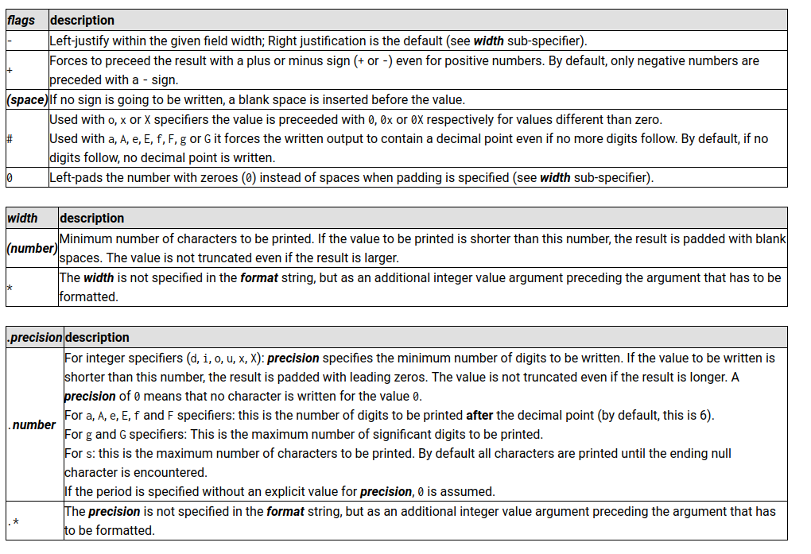

# ft_printf
Recreate printf.

# ft_printf_bonus

## %[$][flags][width][.precision][length modifier]conversion

### Conversion

1. %c Prints a single character.
2. %s Prints a string (as defined by the common C convention).
3. %p The void * pointer argument has to be printed in hexadecimal format.
4. %d Prints a decimal (base 10) number.
5. %i Prints an integer in base 10.
6. %u Prints an unsigned decimal (base 10) number.
7. %x Prints a number in hexadecimal (base 16) lowercase format.
8. %X Prints a number in hexadecimal (base 16) uppercase format.
9. %% Prints a percent sign.

### Flags, width, precision

1. -(minus): This flag specifies left alignment. When used, the output is left-justified within the specified width.

2. 0(zero): This flag indicates that zero-padding should be used. If the width is specified and the data is smaller than this width, it will be padded with zeros on the left.

3. .(period): This is the precision specifier. It is followed by the precision value, which in your case is represented by #. Precision is the number of digits to be printed after the decimal point for floating-point types.

4. #(hash): In this context, it might represent the precision value. The # character is usually used as a placeholder for the precision value when defining the precision for floating-point numbers.

5. +(plus): This flag specifies that the sign should always be shown. It ensures that the number is preceded by a plus or minus sign.

6. Space character: A space character in the format string is used to insert a space before a positive number, making the output aligned when dealing with both positive and negative numbers.

7. (number)(width)Minimum number of characters to be printed. If the value to be printed is shorter than this number, the result is padded with blank spaces. The value is not truncated even if the result is larger.

